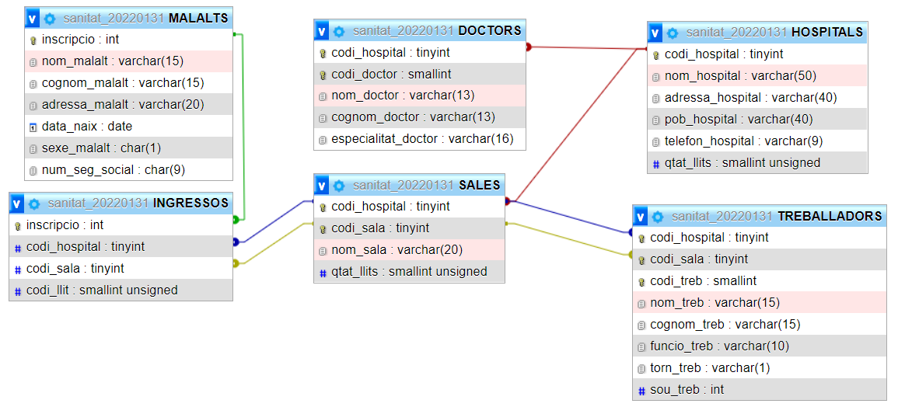

## **MP02**: Bases de dades - **UF02**: Llenguatges SQL: DML i DDL.
# **Examen** 31 de gener de 2022 (***```Examen20220131```***)

<br>

# **Avaluació**

## Cadascun dels 10 apartats de l'examen té una valoració de **```1``` punt**.

<br>

# **Lliurament**

## Crear un repositori al vostre compte de [github.com](https://www.github.com) amb els següents detalls:
> ||Element del repositori|Valor|
> |--|--|--|
> |**1.**| **Nom**|**\<*```CognomNom```*>Examen20220131**|
> |**2.**| **Tipus**| **```Privat```**|
> |**3.**| **Convidar** a l'usuari| ***```joanpardogine```***|

<br>

> ## Exemple del **nom** del repositori, si l'alumne es diu ***Pau Casals***, el nom del fitxer serà ***CasalsPau```Examen20220131```***.

<br>

## El repositori només contindrà un sol fitxer amb el nom ***CognomNom```Examen20220131.sql```*** (amb extensió **```sql```**).
> ## Per exemple, si l'alumne es diu **Pau Casals**, el nom del fitxer serà ***CasalsPau```Examen20220131.sql```***.

<br>
<hr>
<br>

> # **NOTA IMPORTANT**:
> # Cal que en el vostre repositori, hi hagi un **```commit```** cada **quart d'hora**.
> # Els **```commit```**'s cal que tinguin el missatge "**```Control de les 15:00!```**".
> # Evidentment, és imprescindible que es facin a la corresponent hora. Amb un marge d'interval de **5 minuts**. És a dir, com a molt, cinc minuts abans o cinc minuts després.
> # El fet de no tenir **TOTS** els **```commit```**'s, repercutirà **molt negativament** a l'avaluació de l'examen. 

<br>
<hr>
<br>


## El fitxer a lliurar, per a cadascun dels **apartat**s, cal que aparegui, en **TOTS**, els següents punts:

## **1.** L'**enunciat** de l'apartat, en format comentari (**```-- ```**), perquè no interfereixi en l'execució del codi de la vostra solució.

## **2.** La solució que proposeu com a **resposta** al que demana l'enunciat.

## **3.**  El **resultat** que obteniu en executar la vostra solució. També en format comentari (**```-- ```**), perquè no interfereixi en l'execució del codi de la vostra solució.

##  **4.** Recordeu, que com els apartats fan referència a les dues bases de dades que fareu servir, cal sempre indicar a quina **base de dades es vol executar** la solució. Ja que si esteu en una base de dades i executeu la consulta amb les dades de l'altra base de dades, gairebé segur que provocarà un error per no trobar ni les taules ni els camps.


<br>
<hr>
<br>


## Cal que respongueu a **TOTs** els apartats, a partir de les dues bases de dades que trobeu a continuació.
<hr>

## **1.** Base de dades [**```empresa```**](./empresa_20220131.sql).


<hr>

### **2.** Base de dades [**```sanitat```**](./sanitat_20220131.sql).


<hr>

<br>
<br>

# **Apartat 1**

### Sobre la base de dades [**```empresa```**](./empresa_20220131.sql).

## Cal que feu una consulta que mostri, de cada treballador el seu **codi**, el **cognom**, el **salari mensual** del treballador i també el **salari anual** del treballador. Suposem que en un any hi ha **catorze pagues** mensuals.

<br>
<hr>
<br>

# **Apartat 2**

### Sobre la base de dades [**```sanitat```**](./sanitat_20220131.sql).

### Cal que respongueu explicant el màxim possible la següent pregunta.

> ### Recordeu que per afegir comentaris cal que a l'inici de cada línia apareguin els caràcters (**```-- ```**). És a dir, guió, guió i espai en blanc.

## Quin és el valor del camp **```qtat_llits```** de la taula **```HOSPITALS```**, després de l'execució de la següent comanda:

```sql
INSERT INTO HOSPITALS (codi_hospital,nom_hospital,adressa_hospital,pob_hospital,telefon_hospital) VALUES
    (13,'Hospital Universitari de Bellvitge','Carrer de la Feixa Llarga, s/n','Hospitalet de Llobregat','932607500'),
    (18,'Hospital Universitari General de Catalunya','Carrer Pedro i Pons, 1','Sant Cugat del Valles', '935656000'),
    (22,'Hospital de la Santa Creu i Sant Pau','C. Sant Antoni Maria Claret, 167','Barcelona','935537801'),
    (45,'Hospital Clinic i Provincial de Barcelona','C. de Villarroel, 170','Barcelona','932275400');
```

<br>
<hr>
<br>

# **Apartat 3**

### Sobre la base de dades [**```sanitat```**](./sanitat_20220131.sql).

### Cal que respongueu explicant el màxim possible la següent pregunta.

> ### Recordeu que per afegir comentaris cal que a l'inici de cada línia apareguin els caràcters (**```-- ```**). És a dir, guió, guió i espai en blanc.

<br>

## Quin és el valor del camp **```qtat_llits```** de la taula **```HOSPITALS```**, després de l'execució de la següent comanda:

<br>

```sql
UPDATE HOSPITALS 
SET qtat_llits = (SELECT SUM(qtat_llits) 
                  FROM SALES 
                  WHERE HOSPITALS.codi_hospital = SALES.codi_hospital);

```

<br>
<hr>
<br>


# **Apartat 4**

### Sobre la base de dades [**```empresa```**](./empresa_20220131.sql).

## Cal que feu una consulta que mostri, **tots** els productes (**codi** i **descripció**) que contenen la paraula **tenis** en la descripció.

<br>
<hr>
<br>

# **Apartat 5**

### Sobre la base de dades [**```sanitat```**](./sanitat_20220131.sql).

## Cal que feu una consulta que mostri els següents camps dels treballadors:
* ## **codi hospital** amb el nom de la columna **```Codi```**,
* ## **codi sala**,
* ## **codi de treballador** i
* ## **Nom i cognom** (cal que aquests dos camps apareguin ***concatenats*** en una sola columna)

## que **NO** siguin del **torn de nit**.

<br>
<hr>
<br>


# **Apartat 6**

### Sobre la base de dades [**```empresa```**](./empresa_20220131.sql).

## Cal que feu una consulta que mostri una relació de tots els clients (**codi**, **nom** i **observacions**) que tinguin un **crèdit superior** a **```4000```** i **inferior** a **```8000```** i el **nom** dels quals contingui alguna **```S```**.

<br>
<hr>
<br>

# **Apartat 7**

### Sobre la base de dades [**```sanitat```**](./sanitat_20220131.sql).
## Cal que feu dues consultes una que mostri per cada **sala**, la **quantitat de malalts** d'un sexe i la segona la **quantitat de malalts** de l'altre sexe.


<br>
<hr>
<br>


# **Apartat 8**

### Sobre la base de dades [**```empresa```**](./empresa_20220131.sql).
## Cal que feu una consulta que mostri l'**import global** que cada departament assumeix **anualment** en concepte de *nòmina dels treballadors* i ordenat **descendentment** per l'**import global**.

<br>
<hr>
<br>


# **Apartat 9**


## Cal que creeu una consulta la base de dades que vulguis (de les dues de l'examen [**```empresa```**](./empresa_20220131.sql) o [**```sanitat```**](./sanitat_20220131.sql)), que faci servir la comanda **```INNER JOIN```** de tres taules diferents.

## Al fitxer cal que apareguin els següents apartats:

* ``` -- Enunciat de l'activitat 9```

* ``` -- Comanda resultat de l'activitat 9```

* ``` -- Sortida de l'execució de l'activitat 9```

 
 

> ### Recordeu que per afegir comentaris cal que a l'inici de cada línia apareguin els caràcters (**```-- ```**). És a dir, guió, guió i espai en blanc.


<br>
<hr>
<br>


# **Apartat 10**

### Sobre la base de dades [**```sanitat```**](./sanitat_20220131.sql).
### Explica i posa un exemple, de com farieu un insert a la taula **```SALES```**, fent servir un **```SELECT```**, per no tenir que fer servir el **codi de l'hospital**.

```sql
INSERT INTO SALES VALUES (13,1,'Quirofans',50);
```
